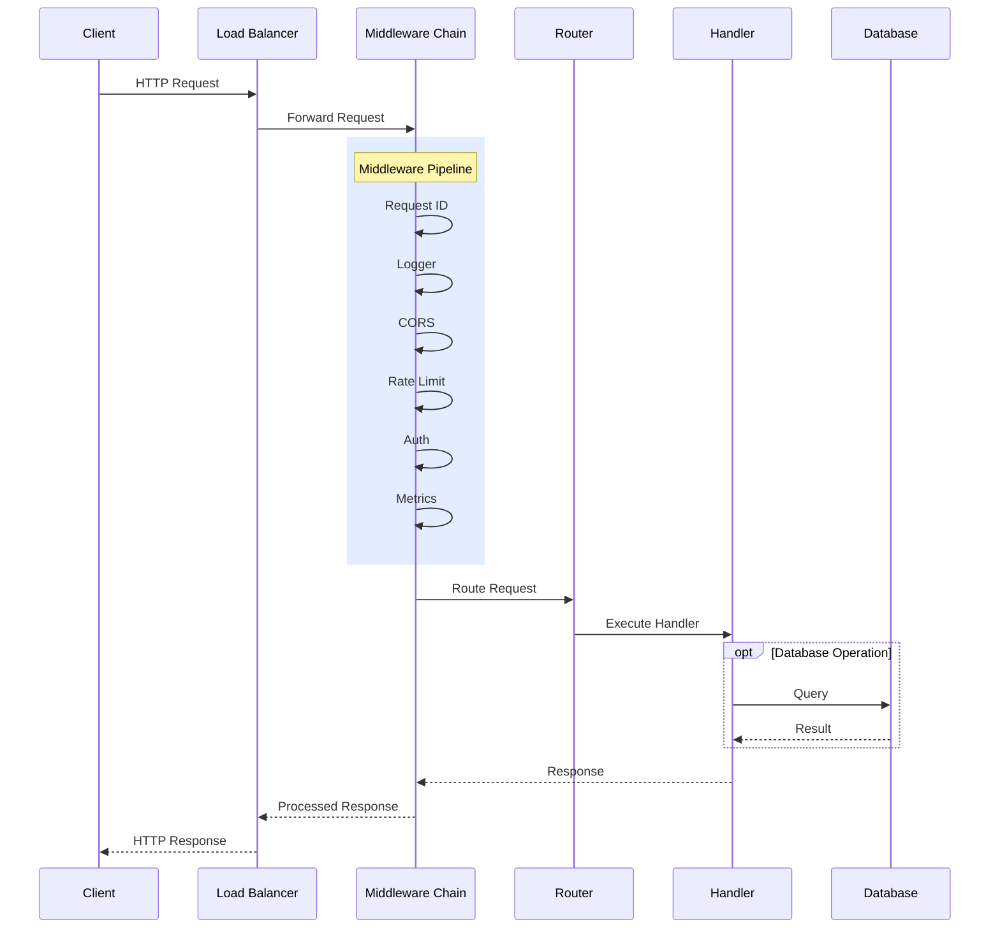
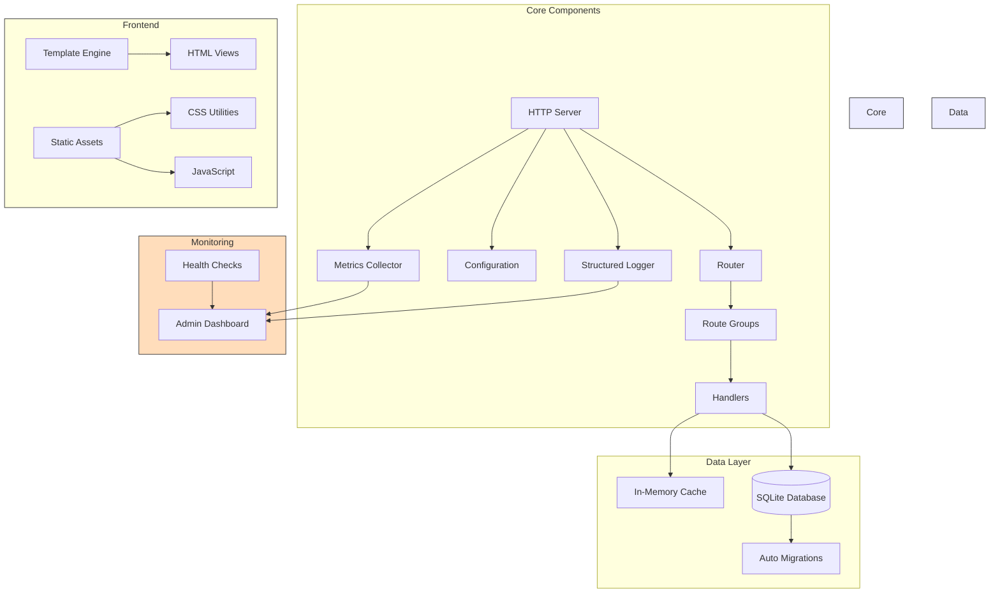

#  WebServer


Lightweight, extensible Go HTTP server with:

- Route grouping and middleware pipeline
- Session-based authentication system
- CORS and security headers
- Request tracking and metrics
- Structured logging
- Health monitoring
- Templating engine for HTML views
- Telegram notifications
- Dark/Light themes
- Embedded SQLite database with transaction support

## Quick Start

```bash
# Clone the repository
git clone https://github.com/magooney-loon/webserver.git
cd webserver

# Run the example server
go run cmd/example/main.go

# Or build and run the binary
go build -o server .
./server
```

## Documentation

- [Configuration Guide](/docs/CONFIGURATION.md) - Server configuration options
- [Templating & API](/docs/TEMPLATING.md) - Template engine and REST API structure
- [Authentication Guide](/docs/AUTH.md) - Session-based auth system details
- [Database Guide](/docs/DB.md) - SQLite singleton implementation
- [CSS Architecture](/docs/CSS.md) - Data-attribute utility approach
- [JavaScript Architecture](/docs/JAVASCRIPT.md) - Component system and data-attribute integration

## Usage

```go
package main

import (
	"context"
	"encoding/json"
	"net/http"
	"time"

	"github.com/magooney-loon/webserver/internal/config"
	"github.com/magooney-loon/webserver/internal/core/middleware"
	"github.com/magooney-loon/webserver/internal/core/server"
	"github.com/magooney-loon/webserver/internal/database"
)

func main() {
	// Load config with structured logging
	cfg, log := config.LoadWithOptions(
		config.WithEnvironment("development"),
		config.WithServerPort(8080),
	)

	// Initialize database with WAL mode
	dbConfig := database.DefaultConfig()
	dbConfig.Path = "./data/app.db"
	dbConfig.WALMode = true
	dbConfig.AutoMigrate = false

	if err := database.Initialize(dbConfig); err != nil {
		log.Fatal("database init failed", map[string]interface{}{
			"error": err.Error(),
		})
	}
	defer func() {
		db, _ := database.GetInstance()
		db.Close()
	}()

	// Define API routes with middleware
	api := server.RouteGroup{
		Prefix: "/api/v1",
		Middleware: []middleware.Middleware{
			// Group-level middleware
		},
		Routes: []server.Route{
			{
				Path:    "/users",
				Method:  http.MethodGet,
				Handler: listUsersHandler,
			},
			{
				Path:    "/users/:id",
				Method:  http.MethodGet,
				Handler: getUserHandler,
			},
		},
	}

	// Start server with options
	srv := server.New(cfg, log,
		server.WithRouteGroup(api),
		server.WithGlobalMiddleware(middleware.RequestID(middleware.RequestIDConfig{})),
	)
	
	if err := srv.Start(); err != nil {
		log.Fatal("server error", map[string]interface{}{
			"error": err.Error(),
		})
	}
}

// Database-integrated handler example
func getUserHandler(w http.ResponseWriter, r *http.Request) {
	ctx, cancel := context.WithTimeout(r.Context(), 5*time.Second)
	defer cancel()
	
	// Get user ID from path params
	userID := r.PathValue("id")
	
	// Get database singleton
	db, _ := database.GetInstance()
	
	// Query user
	var user struct {
		ID       int64     `json:"id"`
		Username string    `json:"username"`
		Email    string    `json:"email"`
		Created  time.Time `json:"created_at"`
	}
	
	row := db.QueryRow(ctx, 
		"SELECT id, username, email, created_at FROM users WHERE id = ?", 
		userID)
	
	if err := row.Scan(&user.ID, &user.Username, &user.Email, &user.Created); err != nil {
		http.Error(w, "User not found", http.StatusNotFound)
		return
	}
	
	w.Header().Set("Content-Type", "application/json")
	json.NewEncoder(w).Encode(user)
}
```

### Default System APIs

The server comes with built-in system routes (enabled by default):

```
GET  /system/health        - Health check endpoint
GET  /system/admin        - Admin dashboard
GET  /system/settings     - Settings page
POST /system/settings     - Save settings
POST /system/settings/reset - Reset settings to defaults
```

Authentication endpoints:
```
GET/POST /system/login    - Login page and handler
GET      /system/logout   - Logout handler
```

All system routes (except login) require authentication by default. Configure auth in your environment:

```bash
SECURITY_AUTH_ENABLED=true
SECURITY_AUTH_USERNAME=admin
SECURITY_AUTH_PASSWORD=passpass
```

### Architecture-Flow Diagram

The server implements a layered architecture with middleware pipeline, request tracking, and metrics collection. Core components are loosely coupled through well-defined interfaces.

#### Request Flow


#### System Architecture


## Core Components and Interfaces

### 1. Server Core 

The server is built around a clean, modular architecture. Key types:

```go
// Server represents the HTTP server and its dependencies
type Server struct {
    cfg      *config.Config       // Application configuration
    log      *logger.Logger       // Structured logging
    srv      *http.Server         // Standard library HTTP server
    wg       sync.WaitGroup       // For shutdown coordination
    shutdown chan struct{}        // Shutdown signal channel
    metrics  *monitoring.Metrics  // Metrics collector
    router   *http.ServeMux       // URL router
    mwChain  *middleware.Chain    // Middleware pipeline
    options  *ServerOptions       // Configurable options
}

// Route defines a single HTTP route
type Route struct {
    Path        string                                 // URL path
    Method      string                                 // HTTP method
    Handler     func(http.ResponseWriter, *http.Request) // Request handler
    Middleware  []middleware.Middleware               // Route-specific middleware
    Description string                                // Route description
}

// RouteGroup defines a group of routes with shared prefix and middleware
type RouteGroup struct {
    Prefix     string                 // URL prefix for all routes in group
    Middleware []middleware.Middleware // Middleware for all routes in group
    Routes     []Route                // Routes in this group
}
```

### 2. Database System

The database uses a singleton pattern with connection pooling:

```go
// Database represents the SQLite database instance
type Database struct {
    db *sql.DB        // Underlying sql.DB instance
    config *Config    // Database configuration
    mu sync.RWMutex   // Mutex for thread safety
    pool *Pool        // Connection pool
    metrics *Metrics  // Performance metrics
    stmtCache map[string]*sql.Stmt // Statement cache
}

// Config holds the database configuration
type Config struct {
    Path string             // File path to SQLite database
    PoolSize int            // Maximum connections in pool
    WALMode bool            // Write-Ahead Logging mode
    AutoMigrate bool        // Apply migrations on startup
    // Other configuration options...
}

// Simple usage:
dbConfig := database.DefaultConfig()
dbConfig.Path = "./data/app.db"
database.Initialize(dbConfig)

// Get singleton instance anywhere in code
db, _ := database.GetInstance()

// Query with timeout
ctx, cancel := context.WithTimeout(context.Background(), 5*time.Second)
defer cancel()

row := db.QueryRow(ctx, "SELECT id, name FROM users WHERE id = ?", 1)
```

### 3. Middleware System

The middleware system follows a composable chain pattern:

```go
// Middleware defines the standard middleware interface
type Middleware func(http.Handler) http.Handler

// Chain represents a chain of middleware
type Chain struct {
    middlewares []Middleware // Ordered list of middleware
    Config      *Config      // Middleware configuration
}

// Example middleware implementation: RequestID
func RequestID(config RequestIDConfig) Middleware {
    return func(next http.Handler) http.Handler {
        return http.HandlerFunc(func(w http.ResponseWriter, r *http.Request) {
            // Generate or extract request ID
            requestID := extractOrGenerateID(r, config)
            
            // Add to context and headers
            ctx := context.WithValue(r.Context(), requestIDKey, requestID)
            r = r.WithContext(ctx)
            w.Header().Set(config.HeaderName, requestID)
            
            // Call next middleware/handler
            next.ServeHTTP(w, r)
        })
    }
}
```

## Database Operations

### Basic CRUD Operations

```go
// Create a record
func createUser(username, email, password string) (int64, error) {
    db, _ := database.GetInstance()
    ctx, cancel := context.WithTimeout(context.Background(), 5*time.Second)
    defer cancel()
    
    result, err := db.Exec(ctx, 
        "INSERT INTO users (username, email, password_hash) VALUES (?, ?, ?)",
        username, email, hashPassword(password))
    if err != nil {
        return 0, err
    }
    
    return result.LastInsertId()
}

// Read a record
func getUser(id int64) (*User, error) {
    db, _ := database.GetInstance()
    ctx, cancel := context.WithTimeout(context.Background(), 5*time.Second)
    defer cancel()
    
    row := db.QueryRow(ctx, 
        "SELECT id, username, email, created_at FROM users WHERE id = ?", id)
    
    var user User
    if err := row.Scan(&user.ID, &user.Username, &user.Email, &user.CreatedAt); err != nil {
        return nil, err
    }
    
    return &user, nil
}

// Update a record
func updateUserEmail(id int64, email string) error {
    db, _ := database.GetInstance()
    ctx, cancel := context.WithTimeout(context.Background(), 5*time.Second)
    defer cancel()
    
    _, err := db.Exec(ctx, 
        "UPDATE users SET email = ?, updated_at = ? WHERE id = ?",
        email, time.Now(), id)
    
    return err
}

// Delete a record
func deleteUser(id int64) error {
    db, _ := database.GetInstance()
    ctx, cancel := context.WithTimeout(context.Background(), 5*time.Second)
    defer cancel()
    
    _, err := db.Exec(ctx, "DELETE FROM users WHERE id = ?", id)
    return err
}
```

### Using Transactions

```go
// Create an order with items in a transaction
func createOrder(ctx context.Context, order Order) (int64, error) {
    db, _ := database.GetInstance()
    
    var orderID int64
    err := db.Transaction(ctx, func(tx *database.Tx) error {
        // Insert order
        result, err := tx.Exec(ctx, 
            "INSERT INTO orders (user_id, total) VALUES (?, ?)",
            order.UserID, order.Total)
        if err != nil {
            return err
        }
        
        orderID, err = result.LastInsertId()
        if err != nil {
            return err
        }
        
        // Insert order items
        for _, item := range order.Items {
            _, err = tx.Exec(ctx, 
                "INSERT INTO order_items (order_id, product_id, quantity) VALUES (?, ?, ?)",
                orderID, item.ProductID, item.Quantity)
            if err != nil {
                return err
            }
        }
        
        return nil
    })
    
    return orderID, err
}
```

## Monitoring and Observability

The server implements comprehensive monitoring:

```go
// Metrics collector 
type Metrics struct {
    activeRequests   int64
    totalRequests    int64
    requestLatencies *metrics.Histogram
    statusCodes      map[int]int64
    requestsByPath   map[string]int64
    requestsByMethod map[string]int64
    visitors         map[string]int64
    mu               sync.RWMutex
}

// Health check system
func (s *SystemHandlers) HandleHealth(w http.ResponseWriter, r *http.Request) {
    // Get system metrics
    health := s.metrics.GetHealth()
    
    // Add database health check
    dbStatus := "ok"
    if err := s.db.Ping(); err != nil {
        dbStatus = "error"
        health.Status = "degraded"
    }
    
    health.Components["database"] = dbStatus
    
    // Return appropriate status code
    if health.Status != "ok" {
        w.WriteHeader(http.StatusServiceUnavailable)
    }
    
    // Marshal and return health data
    w.Header().Set("Content-Type", "application/json")
    json.NewEncoder(w).Encode(health)
}
```

## Configuration Via Environment

Configuration is loaded from environment variables with defaults:

```go
// Config represents the application configuration
type Config struct {
    // Server settings
    Server struct {
        Host            string        // Server host
        Port            int           // Server port
        ReadTimeout     time.Duration // Request read timeout
        WriteTimeout    time.Duration // Response write timeout
        IdleTimeout     time.Duration // Connection idle timeout
        MaxHeaderSize   int64         // Max header size in bytes
        ShutdownTimeout time.Duration // Graceful shutdown timeout
    }
    
    // Environment (development, staging, production)
    Environment string
    
    // Security settings
    Security struct {
        // CORS settings
        CORS CORSConfig
        // Rate Limiting settings
        RateLimit RateLimitConfig
        // Security Headers
        Headers SecurityHeadersConfig
        // Auth settings
        Auth AuthConfig
    }
    
    // System monitoring
    System struct {
        Enabled bool   // Enable system routes
        Prefix  string // System routes prefix
    }
}
```

## Performance Optimization

The server implements several performance optimizations:

1. **Response Pooling**
   ```go
   var responsePool = sync.Pool{
       New: func() interface{} {
           return &bytes.Buffer{}
       },
   }
   
   func getBuffer() *bytes.Buffer {
       return responsePool.Get().(*bytes.Buffer)
   }
   
   func putBuffer(buf *bytes.Buffer) {
       buf.Reset()
       responsePool.Put(buf)
   }
   ```

2. **HTTP/2 Support** via TLS configuration
   ```go
   srv := &http.Server{
       Addr:    ":8443",
       Handler: handler,
       TLSConfig: &tls.Config{
           MinVersion: tls.VersionTLS12,
           CurvePreferences: []tls.CurveID{
               tls.CurveP256,
               tls.X25519,
           },
           PreferServerCipherSuites: true,
           CipherSuites: []uint16{
               tls.TLS_ECDHE_ECDSA_WITH_AES_256_GCM_SHA384,
               tls.TLS_ECDHE_RSA_WITH_AES_256_GCM_SHA384,
               tls.TLS_ECDHE_ECDSA_WITH_CHACHA20_POLY1305,
               tls.TLS_ECDHE_RSA_WITH_CHACHA20_POLY1305,
           },
       },
   }
```

## License

MIT