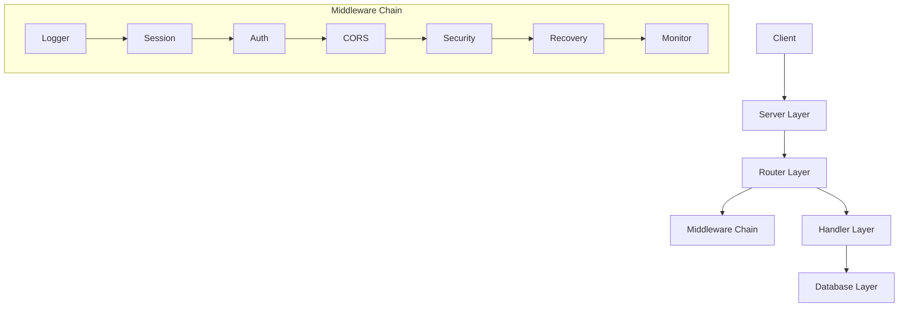

#  WebServer

Lightweight, extensible Go HTTP server


## Architecture Overview



## Core Features

### Server Layer
- HTTP/2 support
- Graceful shutdown
- Route grouping
- Context propagation
- Configuration management

### Middleware Chain
- Extensible middleware pipeline
- Request/Response logging
- Session management
- Authentication/Authorization
- CORS and security headers
- Panic recovery
- Request monitoring

### Database Layer
- SQLite with transaction support
- Connection pooling
- Query caching
- Migration system
- Metrics collection

## Quick Start

```bash
# Clone the repository
git clone https://github.com/magooney-loon/webserver.git
cd webserver

# Run the example server
go run cmd/example/main.go

# Or build and run the binary
go build -o server .
./server
```

## Basic Usage

```go
package main

import (
	"context"
	"log"
	"net/http"

	server "github.com/magooney-loon/webserver/pkg/server/impl"
)

func main() {
	// Create a new server
	srv := server.NewServer()

	// Get the router
	r := srv.Router()

	// Register routes
	r.Handle(http.MethodGet, "/hello", helloHandler)

	// Create API group
	api := r.Group("/api")
	api.Handle(http.MethodGet, "/users", getUsersHandler)
	api.Handle(http.MethodPost, "/users", createUserHandler)

	// Start the server
	if err := srv.Start(context.Background()); err != nil {
		log.Fatal(err)
	}
}
```

## Configuration

```yaml
server:
  port: 8080
  read_timeout: 60
  write_timeout: 60
  max_header_bytes: 1048576

middleware:
  cors:
    allowed_origins: ["*"]
    max_age: 3600
  security:
    hsts: true
    frame_options: "DENY"
  
database:
  driver: sqlite3
  datasource: file:app.db?cache=shared&mode=rwc
  pool:
    max_open: 25
    max_idle: 5
```

## Documentation

- [Server Architecture](docs/SERVER.md) - Core server design and components
- [Middleware Chain](docs/MIDDLEWARE.md) - Middleware system and pipeline
- [Database Layer](docs/DB.md) - Database architecture and features

## License

This project is licensed under the MIT License - see the [LICENSE](LICENSE) file for details.

