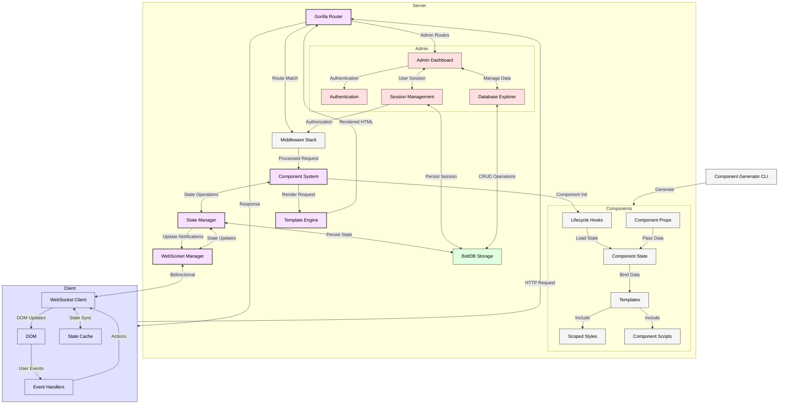

#  WebRender

Golang html/template state manager with WebSocket integration, component system, and full-stack reactivity.

## Core Architecture

WebRender combines server-side templating with reactive state management to create a performant full-stack rendering system:

- **State Management**: Thread-safe reactive state with computed properties, watchers, and cross-client synchronization
- **Component System**: Isolated components with lifecycle hooks, props, scoped styles, and namespaced scripts
- **WebSocket Integration**: Centralized connection management with auto-reconnection, broadcast system, and state preservation
- **Gorilla Toolkit**: Enhanced routing (gorilla/mux), middleware stack, and security features (CSRF protection)
- **Admin Dashboard**: Built-in admin interface with authentication, user management, system analytics, and database management
- **BoltDB Integration**: Embedded key-value database for persistent storage, user management, and component state persistence

## Implementation Status

### ✅ Completed
- Core state management with reactive properties
- Component isolation and lifecycle system
- WebSocket synchronization with broadcast system
- Gorilla router integration
- Admin dashboard foundation
- CSRF protection and authentication
- CLI component generator
- Unified API with auto-registration

### 🔄 In Progress
- Form handling with validation
- Partial re-rendering with DOM diffing
- Update queue optimization
- BoltDB integration for persistent storage
- Admin database explorer UI

### 📅 Planned
- Component extensions (directives, behaviors)
- Advanced Gorilla features integration
- TypeScript/Go type generation
- Component state persistence with BoltDB
- Advanced metrics and analytics with BoltDB storage

## Architecture

```
webrender/
├── pkg/             # Public API packages
│   ├── state/         # State management
│   ├── template/      # Template handling
│   ├── component/     # Component system
│   ├── websocket/     # WebSocket communication
│   ├── middleware/    # Middleware system
│   └── router/        # URL routing
├── internal/        # Private implementation
│   ├── admin/         # Admin dashboard
│   │   ├── components/  # Admin UI components
│   │   ├── handlers/    # Admin route handlers
│   │   ├── middleware/  # Admin-specific middleware
│   │   ├── session/     # Admin session management
│   │   └── database/    # BoltDB storage management
│   └── auth/          # Authentication system
└── examples/        # Example applications
```

## Architecture Flow



## Quick Start

```go
package main

import (
	"fmt"
	"html/template"
	"log"

	"github.com/magooney-loon/webrender/pkg"
	"github.com/magooney-loon/webrender/pkg/components/example"
)

func main() {
	// Create a new WebRender instance with default configuration
	config := pkg.DefaultConfig()

	// Initialize WebRender
	webRender, err := pkg.New(config)
	if err != nil {
		log.Fatalf("Failed to initialize WebRender: %v", err)
	}

	// Register the counter component manually
	counter := example.NewCounter("counter-1")
	if err := webRender.RegisterComponent(counter); err != nil {
		log.Printf("Error registering counter component: %v", err)
	} else {
		log.Println("Counter component registered successfully with ID:", counter.ID)
	}

	// Home page with counter example using the simplified ComponentRoute API
	webRender.ComponentRoute("/", "WebRender Example", "counter-1",
		map[string]interface{}{"title": "Click Counter"},
		func() template.CSS { return template.CSS(example.GetStyles()) },
		func() template.JS { return template.JS(example.GetScripts()) },
	)

	// Alternative using RouteWithTemplate for more control
	webRender.RouteWithTemplate("/alt", "Alternative Example", func() (template.HTML, error) {
		// Render the counter component
		counterHTML, err := webRender.RenderComponent("counter-1", map[string]interface{}{"title": "Custom Counter"})
		if err != nil {
			return "", err
		}
		return template.HTML(counterHTML), nil
	},
		func() template.CSS { return template.CSS(example.GetStyles()) },
		func() template.JS { return template.JS(example.GetScripts()) })

	fmt.Println("To create new components, run the component generator: go run cmd/component/create.go")
	log.Fatal(webRender.Start(":8080"))
}

```

## WebSocket State Synchronization

WebRender implements a sophisticated WebSocket-based state synchronization system:

### Core Architecture

The WebSocket state synchronization system consists of a bidirectional real-time communication layer that ensures all client views remain consistent with the server's authoritative state. Here's how it works internally:

#### Server-Side Implementation

1. **State Management Layer**
   - Maintains authoritative state using thread-safe maps with read-write mutexes
   - Component states are stored in `State` structs with values, computed properties, and watchers
   - `State.Set()` method triggers three critical actions:
     - Updates in-memory values atomically via mutex locks
     - Notifies registered watchers for local effects
     - Broadcasts changes via WebSockets to all connected clients

2. **WebSocket Manager**
   - Implements concurrent client connection handling using Go's channels
   - Uses a Command pattern with three core channels:
     - `register`: Add new client connections
     - `unregister`: Remove disconnected clients
     - `broadcast`: Distribute messages to all clients
   - Message type system with specialized handlers for different operations
   - Processes all events in a single goroutine to prevent race conditions

3. **State Broadcaster**
   - Acts as a facade between state manager and WebSocket manager
   - Normalizes state updates to ensure consistent JSON structure
   - Performs optimistic updates - changes are applied locally before broadcasting

4. **Change Detection**
   - Uses explicit change publication rather than polling
   - When `State.Set()` is called, change details are immediately broadcast
   - Message includes component ID, property key, value, and update type

#### Client-Side Implementation

1. **Connection Management**
   - Implements exponential backoff reconnection (1-30s interval)
   - Maintains client-side message queue for offline operation
   - Detects tab visibility changes to intelligently refresh state
   - Heartbeat system to detect stale connections

2. **State Synchronization**
   - Implements optimistic UI updates for reduced latency
   - State persistence in DOM via `data-state` attributes
   - Granular updates to affected elements using `data-bind` selectors
   - Immediate local application of changes before server confirmation

3. **Pending Updates System**
   - Stores updates for components not yet in DOM
   - Uses MutationObserver to detect when components appear
   - Applies batched updates when components become available
   - Prevents lost updates during dynamic page changes

4. **State Refresh Protocol**
   - Client can request full state refresh via `state_refresh_request`
   - Automatically triggered after reconnection
   - Ensures client state converges with server after disconnection
   - Activated on tab focus to ensure stale tabs get refreshed

### Advanced Synchronization Features

1. **Bidirectional Communication**
   - Server-to-client: Component state updates, computed property refreshes
   - Client-to-server: Action triggers, event notifications, state modifications
   - Optimistic UI updates with server verification

2. **Race Condition Handling**
   - Server-side mutex locks prevent concurrent state modifications
   - Message sequencing ensures updates are applied in the correct order
   - Last-write-wins conflict resolution

3. **Network Resilience**
   - Client maintains update queue during disconnection
   - Automatic reconnection with exponential backoff (max 10 attempts)
   - Full state refresh after reconnection ensures consistency
   - Pending updates system for dynamically created components

4. **DOM Integration**
   - Reactive data binding through custom attributes
   - MutationObserver monitors DOM for dynamically added components
   - Lazy application of pending updates when components appear
   - Event delegation for efficiently handling component actions

This architecture creates a full-stack reactive system where state changes flow seamlessly between server and client, maintaining consistency across all connected browsers while providing responsive UI updates.

## Advanced Usage

### Creating Components

Components in WebRender are modular, reusable building blocks. Here's a real example of the Counter component:

```go
// From pkg/components/example/counter.go
func NewCounter(id string) *component.Component {
    // Create a new component with a unique ID
    c := component.New(id)
    
    // Set up initial state
    c.State.Set("count", 0)
    
    // Define component methods for state manipulation
    c.Methods["increment"] = func(c *component.Component, args ...interface{}) error {
        current := c.State.Get("count").(int)
        return c.State.Set("count", current+1)
    }
    
    c.Methods["decrement"] = func(c *component.Component, args ...interface{}) error {
        current := c.State.Get("count").(int)
        return c.State.Set("count", current-1)
    }
    
    c.Methods["reset"] = func(c *component.Component, args ...interface{}) error {
        return c.State.Set("count", 0)
    }
    
    // Set the component template
    c.SetTemplate(counterTemplate)
    
    return c
}

counterScript = `
		// Counter component handler
		const Counter = {
			increment(componentId) {
				const component = document.getElementById(componentId);
				const state = JSON.parse(component.getAttribute('data-state'));
				const newCount = state.count + 1;
				
				// Update the UI
				component.querySelector('[data-bind="count"]').textContent = newCount;
				
				// Send update to server
				WSManager.sendStateUpdate(componentId, "count", newCount);
			},

			decrement(componentId) {
				const component = document.getElementById(componentId);
				const state = JSON.parse(component.getAttribute('data-state'));
				const newCount = state.count - 1;
				
				// Update the UI
				component.querySelector('[data-bind="count"]').textContent = newCount;
				
				// Send update to server
				WSManager.sendStateUpdate(componentId, "count", newCount);
			}
		};
	`
```

### Template HTML Structure

Templates for components include reactive data binding:

```html
<div id="{{.ID}}" class="component-container" data-component-type="Counter" data-state='{{.State.ToJSON}}'>
    <h2>{{.props.title}}</h2>
    
    <div>
        <div>Current Count</div>
        <div data-bind="count">{{.State.Get "count"}}</div>
    </div>
    
    <div class="flex space-x-3">
        <button data-action="click:decrement">Decrease</button>
        <button data-action="click:reset">Reset</button>
        <button data-action="click:increment">Increase</button>
    </div>
</div>
```

Key features:
- `data-component-type` - Identifies the component type
- `data-state` - Contains the serialized component state
- `data-bind="count"` - Auto-updates when the "count" state changes
- `data-action="click:increment"` - Connects DOM events to component methods

### Component Generator Tool

For quick component scaffolding, WebRender includes a CLI generator:

```bash
go run cmd/component/create.go
```