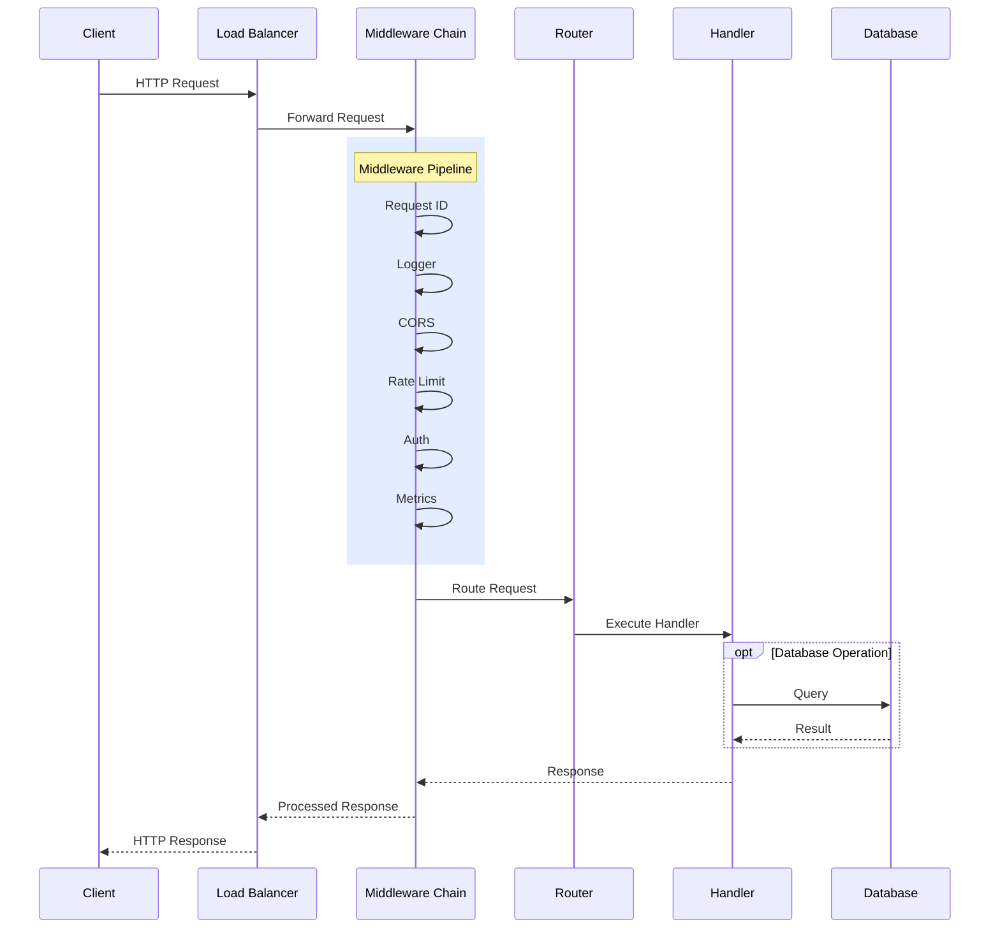
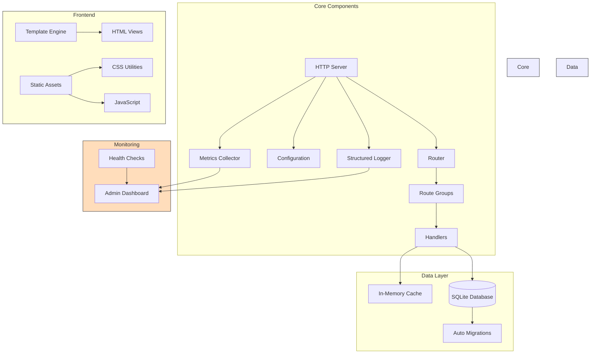

#  WebServer


Lightweight, extensible Go HTTP server with:

- Route grouping and middleware pipeline
- Session-based authentication system
- CORS and security headers
- Request tracking and metrics
- Structured logging
- Health monitoring
- Templating engine for HTML views
- Telegram notifications
- Dark/Light themes

## Quick Start

```bash
# Clone the repository
git clone https://github.com/magooney-loon/webserver.git
cd webserver

# Run the example server
go run cmd/example/main.go

# Or build and run the binary
go build -o server .
./server
```

## Documentation

- [Configuration Guide](/docs/CONFIGURATION.md) - Server configuration options
- [Templating & API](/docs/TEMPLATING.md) - Template engine and REST API structure
- [Authentication Guide](/docs/AUTH.md) - Session-based auth system details
- [Database Guide](/docs/DB.md) - SQLite implementation (WIP)
- [CSS Architecture](/docs/CSS.md) - Data-attribute utility approach
- [JavaScript Architecture](/docs/JAVASCRIPT.md) - Component system and data-attribute integration

## Usage

```go
package main

import (
	"net/http"

	"github.com/magooney-loon/webserver/internal/config"
	"github.com/magooney-loon/webserver/internal/core/middleware"
	"github.com/magooney-loon/webserver/internal/core/server"
)

func main() {
	// Load config with structured logging
	cfg, log := config.LoadWithLogging()

	// Define routes with middleware
	api := server.RouteGroup{
		Prefix: "/api/v1",
		Middleware: []middleware.Middleware{
			// Group-level middleware
		},
		Routes: []server.Route{
			{
				Path:    "/resource",
				Method:  http.MethodGet,
				Handler: resourceHandler,
				Middleware: []middleware.Middleware{
					// Route-specific middleware
				},
			},
		},
	}

	// Start server with options
	srv := server.New(cfg, log,
		server.WithRouteGroup(api),
		server.WithGlobalMiddleware(customMiddleware),
	)
	
	if err := srv.Start(); err != nil {
		log.Fatal("server error", map[string]interface{}{
			"error": err.Error(),
		})
	}
}
```

### Default System APIs

The server comes with built-in system routes (enabled by default):

```
GET  /system/health        - Health check endpoint
GET  /system/admin        - Admin dashboard
GET  /system/settings     - Settings page
POST /system/settings     - Save settings
POST /system/settings/reset - Reset settings to defaults
```

Authentication endpoints:
```
GET/POST /system/login    - Login page and handler
GET      /system/logout   - Logout handler
```

All system routes (except login) require authentication by default. Configure auth in your environment:

```bash
SECURITY_AUTH_ENABLED=true
SECURITY_AUTH_USERNAME=admin
SECURITY_AUTH_PASSWORD=passpass
```

### Architecture-Flow Diagram

The server implements a layered architecture with middleware pipeline, request tracking, and metrics collection. Core components are loosely coupled through well-defined interfaces.

#### Request Flow


#### System Architecture


## Core Components and Interfaces

### 1. Server Core 

The server is built around a clean, modular architecture. Key types:

```go
// Server represents the HTTP server and its dependencies
type Server struct {
    cfg      *config.Config       // Application configuration
    log      *logger.Logger       // Structured logging
    srv      *http.Server         // Standard library HTTP server
    wg       sync.WaitGroup       // For shutdown coordination
    shutdown chan struct{}        // Shutdown signal channel
    metrics  *monitoring.Metrics  // Metrics collector
    router   *http.ServeMux       // URL router
    mwChain  *middleware.Chain    // Middleware pipeline
    options  *ServerOptions       // Configurable options
}

// Route defines a single HTTP route
type Route struct {
    Path        string                                 // URL path
    Method      string                                 // HTTP method
    Handler     func(http.ResponseWriter, *http.Request) // Request handler
    Middleware  []middleware.Middleware               // Route-specific middleware
    Description string                                // Route description
}

// RouteGroup defines a group of routes with shared prefix and middleware
type RouteGroup struct {
    Prefix     string                 // URL prefix for all routes in group
    Middleware []middleware.Middleware // Middleware for all routes in group
    Routes     []Route                // Routes in this group
}
```

### 2. Middleware System

The middleware system follows a composable chain pattern:

```go
// Middleware defines the standard middleware interface
type Middleware func(http.Handler) http.Handler

// Chain represents a chain of middleware
type Chain struct {
    middlewares []Middleware // Ordered list of middleware
    Config      *Config      // Middleware configuration
}

// Example middleware implementation: RequestID
func RequestID(config RequestIDConfig) Middleware {
    return func(next http.Handler) http.Handler {
        return http.HandlerFunc(func(w http.ResponseWriter, r *http.Request) {
            // Generate or extract request ID
            requestID := extractOrGenerateID(r, config)
            
            // Add to context and headers
            ctx := context.WithValue(r.Context(), requestIDKey, requestID)
            r = r.WithContext(ctx)
            w.Header().Set(config.HeaderName, requestID)
            
            // Call next middleware/handler
            next.ServeHTTP(w, r)
        })
    }
}
```

### 3. Response Writer Wrapping

Custom response writer captures metrics:

```go
// responseWriter wraps http.ResponseWriter to capture response data
type responseWriter struct {
    http.ResponseWriter
    status int   // HTTP status code
    size   int64 // Response size in bytes
}

func (rw *responseWriter) WriteHeader(statusCode int) {
    rw.status = statusCode
    rw.ResponseWriter.WriteHeader(statusCode)
}

func (rw *responseWriter) Write(b []byte) (int, error) {
    size, err := rw.ResponseWriter.Write(b)
    rw.size += int64(size)
    return size, err
}
```

### 4. Flow Control and Lifecycle

The server implements graceful startup and shutdown:

```go
// Start initializes and starts the HTTP server
func (s *Server) Start() error {
    // Setup routes first
    s.setupRoutes()
    
    // Apply all middleware
    handler := s.applyMiddleware(s.router)
    
    // Configure HTTP server
    addr := fmt.Sprintf("%s:%d", s.cfg.Server.Host, s.cfg.Server.Port)
    s.srv = &http.Server{
        Addr:           addr,
        Handler:        handler,
        ReadTimeout:    s.cfg.Server.ReadTimeout,
        WriteTimeout:   s.cfg.Server.WriteTimeout,
        MaxHeaderBytes: int(s.cfg.Server.MaxHeaderSize),
    }
    
    // Start HTTP server in background
    go s.startHTTPServer(addr)
    
    // Wait for shutdown signal
    return s.waitForShutdown()
}

// waitForShutdown handles graceful shutdown on signals
func (s *Server) waitForShutdown() error {
    quit := make(chan os.Signal, 1)
    signal.Notify(quit, syscall.SIGINT, syscall.SIGTERM)
    
    <-quit
    s.log.Info("shutting down server", nil)
    
    ctx, cancel := context.WithTimeout(
        context.Background(), 
        s.cfg.Server.ShutdownTimeout,
    )
    defer cancel()
    
    // Gracefully shutdown HTTP server
    if err := s.srv.Shutdown(ctx); err != nil {
        return fmt.Errorf("server shutdown error: %v", err)
    }
    
    // Wait for all handlers to complete
    s.wg.Wait()
    close(s.shutdown)
    
    return nil
}
```

### 5. Middleware Configuration

Detailed configuration for middleware:

```go
// Config represents the unified configuration for all middleware
type Config struct {
    // Logging configuration
    Logging struct {
        Enabled        bool     // Enable/disable logging
        IncludeHeaders bool     // Include request headers in logs
        HeadersToLog   []string // Specific headers to log
        SkipPaths      []string // Paths to skip logging
    }

    // Security configuration
    Security struct {
        // CORS settings
        CORS CORSConfig
        // Rate Limiting settings
        RateLimit RateLimitConfig
        // Security Headers
        Headers SecurityHeadersConfig
        // Auth settings
        Auth AuthConfig
    }

    // Request tracking configuration
    RequestTracking struct {
        Enabled          bool          // Enable request tracking
        HeaderName       string        // Request ID header name
        ContextKey       string        // Context key for request ID
        GenerateCustomID func() string // Custom ID generator
    }
}
```

## Request Processing Lifecycle

The HTTP request lifecycle:

1. **Transport Layer Reception**: Raw HTTP request arrives at the server's TCP port
   ```go
   // Handled by net/http.Server.ListenAndServe()
   ```

2. **Request Context Creation**: The request is wrapped with context and tracking IDs
   ```go
   // Inside RequestID middleware
   requestID := uuid.New().String()
   ctx := context.WithValue(r.Context(), requestIDKey, requestID)
   r = r.WithContext(ctx)
   w.Header().Set(config.HeaderName, requestID)
   ```

3. **Middleware Chain Processing**: Request flows through the middleware chain
   ```go
   // Middleware chain execution
   func (c *Chain) Then(h http.Handler) http.Handler {
       // Apply middleware in reverse order (last middleware executes first)
       for i := len(c.middlewares) - 1; i >= 0; i-- {
           h = c.middlewares[i](h)
       }
       return h
   }
   ```

4. **Route Matching**: Request is matched to a registered route
   ```go
   // Router implementation
   methodRouter := http.HandlerFunc(func(w http.ResponseWriter, r *http.Request) {
       // Look up the handler for this method
       if handler, ok := methodHandlers[r.Method]; ok {
           handler(w, r)
       } else {
           // Method not allowed
           w.Header().Set("Allow", getAllowedMethods(methodHandlers))
           http.Error(w, "Method not allowed", http.StatusMethodNotAllowed)
       }
   })
   ```

5. **Handler Execution**: Route handler processes the request and generates response
   ```go
   // Example handler
   func resourceHandler(w http.ResponseWriter, r *http.Request) {
       // Parse request
       var req RequestBody
       if err := json.NewDecoder(r.Body).Decode(&req); err != nil {
           http.Error(w, "Bad request", http.StatusBadRequest)
           return
       }
       
       // Process and generate response
       response := processRequest(req)
       
       // Write response
       w.Header().Set("Content-Type", "application/json")
       json.NewEncoder(w).Encode(response)
   }
   ```

6. **Response Middleware Processing**: Response flows back through middleware chain
   ```go
   // Response is processed in reverse middleware order
   // Each middleware can modify the response on the way out
   ```

7. **Metrics Collection**: Response metrics are captured during processing
   ```go
   // In metricsMiddleware
   s.metrics.RecordRequest(
       r.URL.Path,
       r.Method,
       wrapped.status,
       time.Since(start),
       r.ContentLength,
       wrapped.size,
   )
   ```

8. **Response Delivery**: HTTP response is delivered to client
   ```go
   // Handled by net/http.ResponseWriter implementations
   ```

## Advanced Usage Examples

### Custom Rate-Limited API with Database Transactions

```go
// Define the rate limited API group
apiGroup := server.RouteGroup{
    Prefix: "/api/v1",
    Middleware: []middleware.Middleware{
        middleware.CORS(middleware.CORSConfig{
            AllowedOrigins: []string{"https://example.com"},
            AllowedMethods: []string{"GET", "POST", "PUT", "DELETE"},
        }),
        middleware.RateLimit(middleware.RateLimitConfig{
            Enabled:  true,
            Requests: 100,
            Window:   time.Minute,
            ByIP:     true,
        }),
    },
    Routes: []server.Route{
        {
            Path:    "/transactions",
            Method:  http.MethodPost,
            Handler: transactionHandler,
            Middleware: []middleware.Middleware{
                middleware.SessionAuth(middleware.AuthConfig{
                    Enabled:    true,
                    CookieName: "session_token",
                }),
                transactionMiddleware, // Custom middleware for DB transactions
            },
        },
    },
}

// Custom middleware for database transactions
func transactionMiddleware(next http.Handler) http.Handler {
    return http.HandlerFunc(func(w http.ResponseWriter, r *http.Request) {
        // Start transaction
        tx, err := db.Begin()
if err != nil {
            http.Error(w, "Failed to start transaction", http.StatusInternalServerError)
            return
        }
        
        // Store transaction in request context
        ctx := context.WithValue(r.Context(), txKey, tx)
        r = r.WithContext(ctx)
        
        // Use custom response writer to track if transaction should commit
        tw := &txResponseWriter{
            ResponseWriter: w,
            status:         http.StatusOK,
        }
        
        // Call next handler
        next.ServeHTTP(tw, r)
        
        // Commit or rollback based on response status
        if tw.status >= 200 && tw.status < 300 {
            if err := tx.Commit(); err != nil {
                log.Printf("Transaction commit failed: %v", err)
            }
        } else {
            if err := tx.Rollback(); err != nil {
                log.Printf("Transaction rollback failed: %v", err)
            }
        }
    })
}
```

## Monitoring and Observability

The server implements comprehensive monitoring:

```go
// Metrics collector 
type Metrics struct {
    activeRequests   int64
    totalRequests    int64
    requestLatencies *metrics.Histogram
    statusCodes      map[int]int64
    requestsByPath   map[string]int64
    requestsByMethod map[string]int64
    visitors         map[string]int64
    mu               sync.RWMutex
}

// Health check system
func (s *SystemHandlers) HandleHealth(w http.ResponseWriter, r *http.Request) {
    // Get system metrics
    health := s.metrics.GetHealth()
    
    // Add database health check
    dbStatus := "ok"
    if err := s.db.Ping(); err != nil {
        dbStatus = "error"
        health.Status = "degraded"
    }
    
    health.Components["database"] = dbStatus
    
    // Return appropriate status code
    if health.Status != "ok" {
        w.WriteHeader(http.StatusServiceUnavailable)
    }
    
    // Marshal and return health data
    w.Header().Set("Content-Type", "application/json")
    json.NewEncoder(w).Encode(health)
}
```

## Configuration Via Environment

Configuration is loaded from environment variables with defaults:

```go
// Config represents the application configuration
type Config struct {
    // Server settings
    Server struct {
        Host            string        // Server host
        Port            int           // Server port
        ReadTimeout     time.Duration // Request read timeout
        WriteTimeout    time.Duration // Response write timeout
        IdleTimeout     time.Duration // Connection idle timeout
        MaxHeaderSize   int64         // Max header size in bytes
        ShutdownTimeout time.Duration // Graceful shutdown timeout
    }
    
    // Environment (development, staging, production)
    Environment string
    
    // Security settings
    Security struct {
        // CORS settings
        CORS struct {
            Enabled          bool     // Enable/disable CORS
            AllowedOrigins   []string // Allowed origins
            AllowedMethods   []string // Allowed HTTP methods
            AllowedHeaders   []string // Allowed request headers
            ExposedHeaders   []string // Exposed response headers
            AllowCredentials bool     // Allow credentials
            MaxAge           int      // Preflight cache time
        }
        
        // Rate limiting
        RateLimit struct {
            Enabled  bool                     // Enable rate limiting
            Requests int                      // Default requests per window
            Window   time.Duration            // Time window
            ByIP     bool                     // Enable IP-based limiting
            ByRoute  bool                     // Enable route-based limiting
            Routes   map[string]RateLimitRule // Route-specific rules
        }
        
        // Security headers
        Headers struct {
            XSSProtection           string // XSS protection
            ContentTypeOptions      string // Content type options
            XFrameOptions           string // Frame options
            ContentSecurityPolicy   string // CSP directives
            ReferrerPolicy          string // Referrer policy
            StrictTransportSecurity string // HSTS settings
            PermissionsPolicy       string // Permissions policy
        }
        
        // Authentication
        Auth struct {
            Enabled      bool     // Enable auth
            Username     string   // Admin username
            Password     string   // Admin password
            ExcludePaths []string // Paths not requiring auth
        }
    }
    
    // System monitoring
    System struct {
        Enabled bool   // Enable system routes
        Prefix  string // System routes prefix
    }
}
```

## Performance Optimization

The server implements several performance optimizations:

1. **Response Pooling**
   ```go
   var responsePool = sync.Pool{
       New: func() interface{} {
           return &bytes.Buffer{}
       },
   }
   
   func getBuffer() *bytes.Buffer {
       return responsePool.Get().(*bytes.Buffer)
   }
   
   func putBuffer(buf *bytes.Buffer) {
       buf.Reset()
       responsePool.Put(buf)
   }
   ```

2. **HTTP/2 Support** via TLS configuration
   ```go
   srv := &http.Server{
       Addr:    ":8443",
       Handler: handler,
       TLSConfig: &tls.Config{
           MinVersion: tls.VersionTLS12,
           CurvePreferences: []tls.CurveID{
               tls.CurveP256,
               tls.X25519,
           },
           PreferServerCipherSuites: true,
           CipherSuites: []uint16{
               tls.TLS_ECDHE_ECDSA_WITH_AES_256_GCM_SHA384,
               tls.TLS_ECDHE_RSA_WITH_AES_256_GCM_SHA384,
               tls.TLS_ECDHE_ECDSA_WITH_CHACHA20_POLY1305,
               tls.TLS_ECDHE_RSA_WITH_CHACHA20_POLY1305,
           },
       },
   }
```

## License

MIT