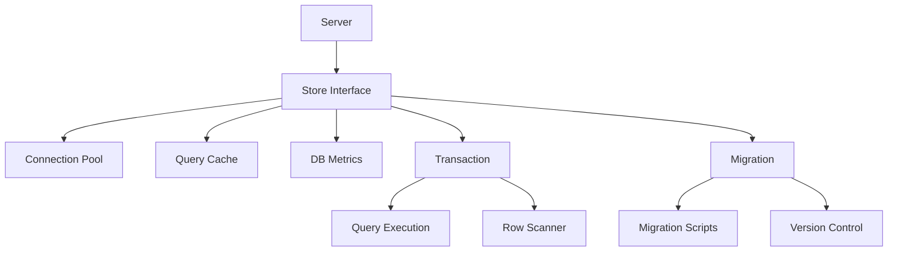
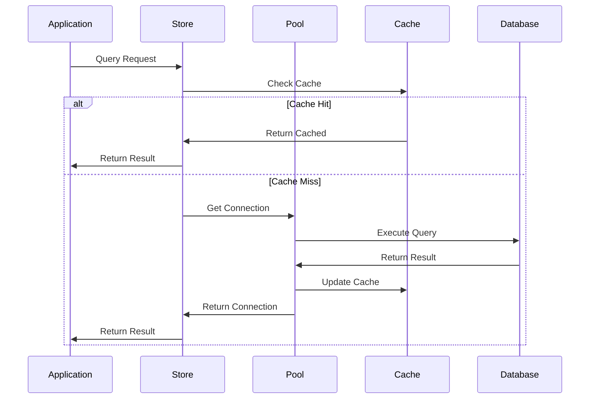

# Database Architecture

## Overview



## Core Components

### Store Interface
```go
type Store interface {
    Initialize() error
    Close() error
    DB() *sql.DB
    WithContext(ctx context.Context) Store
}
```

The store is the main entry point that:
- Manages database lifecycle
- Handles connection pooling
- Provides transaction support
- Integrates with context

### Database Configuration
```go
type Config struct {
    Driver          string
    DataSource      string
    MaxOpenConns    int
    MaxIdleConns    int
    ConnMaxLifetime int
    Options         map[string]interface{}
}
```

### Query Options
```go
type QueryOptions struct {
    Timeout     int
    ReadOnly    bool
    UsePrepared bool
    UseCache    bool
    CacheTTL    int
}
```

### Transaction Interface
```go
type Transaction interface {
    Commit() error
    Rollback() error
    WithContext(ctx context.Context) Transaction
}
```

### Result Interface
```go
type Result interface {
    LastInsertId() (int64, error)
    RowsAffected() (int64, error)
}
```

## Integration Points

### 1. Server Integration
```go
func NewServer(options ...ServerOption) Server {
    db, err := database.GetInstance()
    if err != nil {
        log.Fatal("Failed to get database instance")
    }
    
    // Server configuration with DB
    srv := &server{
        db: db,
        // other fields...
    }
}
```

### 2. Middleware Integration
```go
// Transaction middleware
func WithTransaction(db Store) Middleware {
    return func(next http.Handler) http.Handler {
        return http.HandlerFunc(func(w http.ResponseWriter, r *http.Request) {
            tx, err := db.Begin()
            if err != nil {
                http.Error(w, "Failed to start transaction", 500)
                return
            }
            defer tx.Rollback()
            
            ctx := context.WithValue(r.Context(), txKey, tx)
            next.ServeHTTP(w, r.WithContext(ctx))
            
            if err := tx.Commit(); err != nil {
                http.Error(w, "Failed to commit transaction", 500)
            }
        })
    }
}
```

## Features

### 1. Connection Pooling
- Dynamic pool sizing
- Connection lifetime management
- Idle connection cleanup
- Connection health checks

### 2. Query Caching
```go
type CacheOptions struct {
    Enabled bool
    TTL     time.Duration
    Size    int
}
```
- In-memory caching
- TTL-based invalidation
- Query result caching
- Cache size management

### 3. Migrations
```go
type Migration struct {
    Version     int64
    Description string
    Up          string
    Down        string
}
```
- Version control
- Up/down migrations
- Transaction support
- Migration history

### 4. Metrics
```go
type DBMetrics struct {
    OpenConnections    prometheus.Gauge
    InUseConnections   prometheus.Gauge
    IdleConnections    prometheus.Gauge
    WaitCount         prometheus.Counter
    WaitDuration      prometheus.Histogram
    QueryDuration     prometheus.Histogram
}
```
- Connection stats
- Query performance
- Pool utilization
- Error tracking

## Database Flow



## Best Practices

### 1. Connection Management
- Use connection pooling
- Set appropriate timeouts
- Monitor pool metrics
- Handle connection errors

### 2. Query Optimization
- Use prepared statements
- Implement query caching
- Set query timeouts
- Use transactions appropriately

### 3. Error Handling
- Use context cancellation
- Implement retries
- Log detailed errors
- Handle deadlocks

### 4. Security
- Use prepared statements
- Validate inputs
- Encrypt sensitive data
- Use least privilege

### 5. Performance
- Index optimization
- Query optimization
- Connection pooling
- Result caching

## Configuration Example
```yaml
database:
  driver: sqlite3
  datasource: file:app.db?cache=shared&mode=rwc
  pool:
    max_open: 25
    max_idle: 5
    max_lifetime: 300
  cache:
    enabled: true
    ttl: 300
    size: 1000
  metrics:
    enabled: true
    collect_interval: 10
```

## Integration with Server and Middleware

### Server Layer
- Database initialization
- Connection management
- Error handling
- Graceful shutdown

### Middleware Layer
- Transaction management
- Query metrics
- Error recovery
- Cache control

For detailed server documentation, see [SERVER.md](SERVER.md)
For detailed middleware documentation, see [MIDDLEWARE.md](MIDDLEWARE.md)
