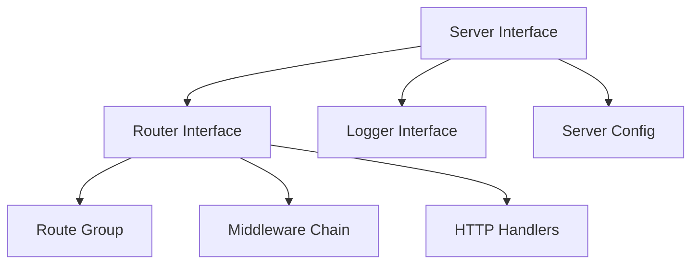
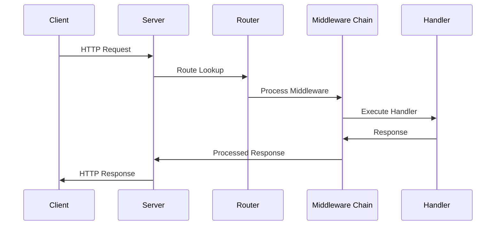

# Server Architecture

## Overview



## Core Components

### Server Interface
```go
type Server interface {
    Start(ctx context.Context) error
    Stop(ctx context.Context) error
    Router() Router
}
```

The server is the main entry point that:
- Manages HTTP server lifecycle
- Provides routing capabilities
- Integrates middleware chain
- Handles graceful shutdown

### Router Interface
```go
type Router interface {
    Handle(method, path string, handler http.HandlerFunc)
    Group(prefix string) RouteGroup
    Use(middleware ...func(http.Handler) http.Handler)
}
```

The router:
- Registers HTTP handlers
- Creates route groups
- Applies middleware
- Handles path matching

### Route Groups
```go
type RouteGroup interface {
    Handle(method, path string, handler http.HandlerFunc)
    Group(prefix string) RouteGroup
    Use(middleware ...func(http.Handler) http.Handler)
}
```

Route groups allow:
- Nested routing
- Prefix-based routing
- Group-specific middleware
- Modular API organization

### Server Configuration
```go
type ServerConfig struct {
    Port           int
    ReadTimeout    int
    WriteTimeout   int
    MaxHeaderBytes int
    AllowedOrigins []string
    AllowedMethods []string
    AllowedHeaders []string
    ExposedHeaders []string
    TrustedProxies []string
}
```

### Logger System
```go
type Logger interface {
    With(fields Fields) Logger
    WithContext(ctx context.Context) Logger
    Debug(msg string, fields ...Fields)
    Info(msg string, fields ...Fields)
    Warn(msg string, fields ...Fields)
    Error(msg string, fields ...Fields)
    Fatal(msg string, fields ...Fields)
}

type LoggerConfig struct {
    Level       LogLevel
    ServiceName string
    Environment string
    OutputPaths []string
    Development bool
}
```

## Middleware Integration

The server integrates with middleware through multiple points:

1. Global Middleware
```go
// Applied to all routes
router.Use(
    middleware.Logger(),
    middleware.Recovery(),
    middleware.Security(),
)
```

2. Group Middleware
```go
// Applied to specific route groups
api := router.Group("/api")
api.Use(
    middleware.Auth(),
    middleware.CORS(),
)
```

3. Route-Specific Middleware
```go
// Applied to individual routes
router.Handle("GET", "/admin",
    middleware.Chain{
        middleware.RequireAdmin(),
        middleware.RateLimit(),
    }.Then(adminHandler),
)
```

## Request Flow



## Server Lifecycle

1. Initialization
```go
srv := server.NewServer(
    server.WithPort(8080),
    server.WithLogger(logger),
)
```

2. Middleware Setup
```go
router := srv.Router()
router.Use(
    middleware.Logger(),
    middleware.Recovery(),
)
```

3. Route Registration
```go
router.Handle("GET", "/", homeHandler)
api := router.Group("/api")
api.Handle("POST", "/users", createUser)
```

4. Start/Stop
```go
// Start server
go srv.Start(ctx)

// Graceful shutdown
srv.Stop(ctx)
```

## Best Practices

1. Server Configuration
- Use environment-based config
- Set reasonable timeouts
- Configure appropriate buffer sizes
- Use TLS in production

2. Route Organization
- Group related routes
- Use semantic versioning
- Keep handlers focused
- Document API endpoints

3. Error Handling
- Use appropriate status codes
- Return consistent error formats
- Log errors with context
- Handle panics gracefully

4. Performance
- Set connection limits
- Configure timeouts
- Use connection pooling
- Enable compression

5. Security
- Enable security headers
- Validate all inputs
- Use rate limiting
- Implement proper auth

## Integration with Middleware

The server's middleware system (detailed in MIDDLEWARE.md) integrates at multiple levels:

1. Global Level (Server)
- Logger Middleware
- Recovery Middleware
- Security Headers

2. Route Group Level
- Authentication
- Authorization
- CORS
- Rate Limiting

3. Route Level
- Validation
- Caching
- Custom Business Logic

For detailed middleware documentation, see [MIDDLEWARE.md](MIDDLEWARE.md) 